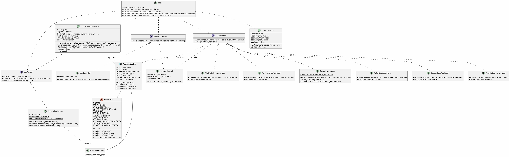

# LogAnalyzer

A robust, production-ready Java application for parsing and analyzing Apache web server logs with real-time streaming capabilities.

## 🚀 Features

- **Multiple Analysis Types**:
    - Request volume analysis
    - HTTP status code distribution
    - Top endpoints identification
    - Traffic patterns by hour
    - Performance metrics (response sizes, data transfer)
    - Security analysis (suspicious requests, failed authentications)

- **Real-Time Streaming**: Monitor log files in real-time and detect issues as they happen
- **Flexible Export**: JSON and text report generation
- **Extensible Architecture**: Easy to add new analyzers and log formats
- **Production-Ready**: Comprehensive error handling, logging, and validation

## 🛠️ Technologies

- Java 21
- Maven 3.9+
- Lombok
- SLF4J/Logback
- Jackson (JSON)
- JUnit 5

## 📦 Installation

```bash
# Clone the repository
git clone https://github.com/Matei-Gatin/LogAnalyzer.git
cd LogAnalyzer

# Build the project
mvn clean package

# Run the application
java -jar target/LogAnalyzer-1.0-SNAPSHOT.jar access.log
```

## 💻 Usage

### Batch Analysis Mode

Analyze an entire log file and generate reports:

```bash
# Basic analysis
java -jar LogAnalyzer.jar access.log

# Specify output directory
java -jar LogAnalyzer.jar access.log -o ./reports

# Disable JSON export
java -jar LogAnalyzer.jar access.log --no-json
```

### Real-Time Streaming Mode

Monitor logs in real-time:

```bash
java -jar LogAnalyzer.jar access.log --stream
```

### Command-Line Options

```
-o, --output <dir>     Output directory for reports (default: current directory)
-s, --stream           Enable real-time streaming mode
--no-json              Disable JSON export
-v, --verbose          Enable verbose logging
-h, --help             Show help message
```

## 📊 Output Examples

### Console Output
```
============================================================
Total Request Analyzer
Total Requests: 1,234
Average Requests/Hour: 51.4
============================================================

============================================================
Security Analyzer
Suspicious Requests: 5
Potential Attackers: 2
Failed Auth Attempts: 15
============================================================
```

### JSON Report Structure
```json
[
  {
    "analyzerName": "Status Code Analyzer",
    "data": {
      "200": 1000,
      "404": 50,
      "500": 5
    },
    "summary": "Most common status: 200 (1000 occurrences)"
  }
]
```

## 🏗️ Architecture



```
LogAnalyzer
├── parser/          - Log file parsers (Apache, Nginx, etc.)
├── analyzer/        - Analysis strategies
├── model/           - Domain models
├── stream/          - Real-time processing
├── export/          - Report exporters
├── cli/             - Command-line interface
└── exception/       - Custom exceptions
```

## 🧪 Testing

```bash
# Run all tests
mvn test

# Run with coverage
mvn test jacoco:report
```

## 🔧 Extending the Application

### Adding a New Analyzer

```java
public class CustomAnalyzer implements LogAnalyzer {
    @Override
    public AnalysisResult analyze(List<AbstractLogEntry> entries) {
        // Your analysis logic
        return new AnalysisResult(getAnalyzerName(), data, summary);
    }

    @Override
    public String getAnalyzerName() {
        return "Custom Analyzer";
    }
}
```

### Adding a New Log Format

```java
public class NginxLogParser implements LogParser {
    @Override
    public List<AbstractLogEntry> parse() {
        // Your parsing logic
    }
}
```

## 📝 License

MIT License

## 👤 Author

[Matei-Gatin](https://github.com/matei-gatin)